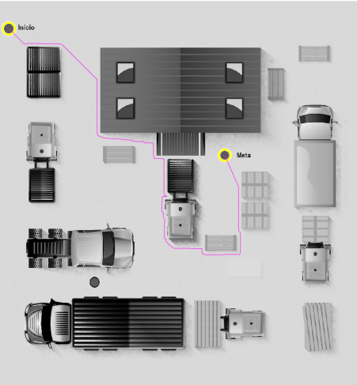

# Computer-Vision

Usando el software de Matlab se realizara un procesamiento de imágenes para poder encontrar el camino mas óptimo utilizando búsquedas heurísticas. El mapa a analizarse contendrá objetos y obstáculos, a los cuales se les aplicara segmentación y operaciones morfológicas para poder realizar un análisis de nodos y aplicar una heurísticas como lo es la distancia euclidiana en conjunto a pesos de cada nodo.

```bash
git clone https://github.com/ndcastill/Computer-Vision.git
```

## Layout 2


## Binarización, Detección de Orillas y Morfolización.


## Nodo Iterante


## Objeto de Nodo Viajero


## Resultados para Layout2, Layout3, Layout4, Layout5


    
